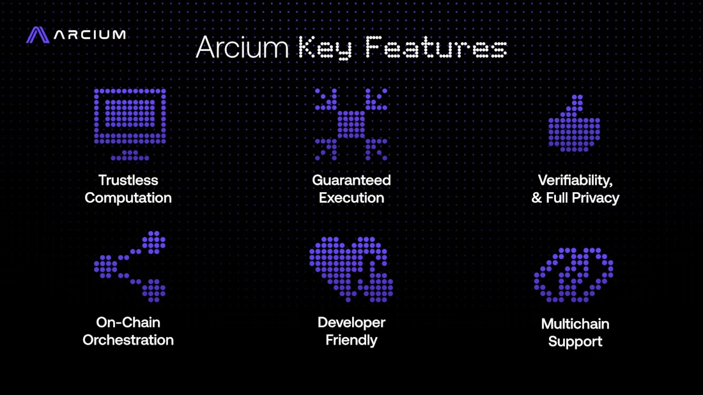

# Fitur Utama dan Use Case

Pada bagian ini, kami memberikan gambaran umum mengenai **fitur utama jaringan** dan **berbagai use case yang memungkinkan**.

Teknologi MPC milik Arcium memberikan keunggulan signifikan yang dapat diterapkan pada berbagai use case bernilai tinggi dalam skala luas.

<figure><figcaption></figcaption></figure>

### Fitur Utama

Berikut adalah fitur-fitur utama yang menjadikan Arcium Network sebagai solusi mutakhir untuk komputasi yang aman:

1. **Komputasi Terenkripsi Arbitrer yang Trustless**\
   Arcium Network bersifat trustless melalui [MPC eXecution Environments (MXEs)](../multi-party-execution-environments-mxes/gambaran-umum.md) yang memungkinkan komputasi apa pun pada data terenkripsi tanpa pernah mengekspos data tersebut.
2. **Eksekusi yang Terjamin**\
   Dengan memanfaatkan sistem orkestrasi berbasis blockchain, Arcium Network memastikan seluruh komputasi di dalam [MXEs](../multi-party-execution-environments-mxes/gambaran-umum.md) dijalankan secara andal. Protokol Arcium menegakkan kepatuhan melalui mekanisme staking dan slashing, di mana node menyetor jaminan (collateral) yang dapat dikenai penalti jika menyimpang dari aturan eksekusi yang disepakati, sehingga setiap komputasi dijamin selesai dengan benar.
3. **Verifiabilitas dan Privasi**\
   Arcium menyediakan mekanisme komputasi yang dapat diverifikasi, memungkinkan para partisipan untuk mengaudit secara publik kebenaran hasil komputasi.
4. **Orkestrasi Onchain**\
   Jaringan ini memanfaatkan blockchain Solana untuk mengelola penjadwalan, kompensasi, dan insentif kinerja bagi node. Staking, slashing, dan berbagai insentif lainnya ditegakkan secara [sepenuhnya onchain](../integrasi-solana-dan-koordinasi-multi-rantai/integrasi-solana-orkestrasi-dan-eksekusi.md).
5. **Antarmuka yang Ramah Developer**\
   Arcium menyediakan dua jenis antarmuka: antarmuka grafis berbasis web untuk kemudahan penggunaan bagi non-ahli, serta SDK yang kompatibel dengan Solana bagi developer yang ingin membangun aplikasi kustom. Pendekatan ini membuat komputasi rahasia dapat diakses baik oleh pengguna umum maupun developer teknis tingkat lanjut.
6. **Multi-Chain**\
   Meskipun pada awalnya dibangun di atas Solana, Arcium Network dirancang agar kompatibel dengan [banyak blockchain](../integrasi-solana-dan-koordinasi-multi-rantai/ekspansi-multichain.md).

Melalui fitur-fitur ini, Arcium Network bertujuan untuk mendefinisikan ulang cara data sensitif diproses dan dibagikan dalam lingkungan trustless, mendorong adopsi Multi-Party Computation yang aman secara lebih luas, serta membuka era baru privasi dan keamanan data.

### Use Case

Enkripsi dapat diterapkan pada hampir semua use case menggunakan Arcium. Untuk mengeksplorasi berbagai kemungkinan use case dan menemukan apa saja yang bisa Anda bangun dengan Arcium, silakan [bergabung ke Discord kami dan hubungi tim kami](https://discord.com/invite/arcium).

Berikut adalah beberapa use case yang paling membuat kami antusias:

1. **DeFi Rahasia (Confidential DeFi)**\
   Developer dapat membangun dApp yang menjamin privasi pengguna, memungkinkan transaksi dan interaksi smart contract dilakukan secara rahasia tanpa mengorbankan keamanan atau transparansi.
2. **Analitik Data Kolaboratif**\
   Banyak organisasi dapat menghitung insight dari data terenkripsi tanpa perlu membagikan data mentah yang sensitif. Sangat ideal untuk industri seperti kesehatan dan keuangan, di mana privasi data adalah hal yang krusial.
3. **Pelatihan Model AI yang Aman**\
   Organisasi dapat melatih model AI secara kolaboratif menggunakan dataset terenkripsi tanpa mengekspos informasi proprietary satu sama lain.
4. **Dark Pool**\
   Teknologi MPC Arcium memungkinkan pembuatan dark pool yang trustless, sehingga para partisipan dapat berdagang secara privat tanpa mengungkap detail order yang sensitif. Hal ini menjaga kerahasiaan transaksi dan mencegah manipulasi pasar serta front-running, sekaligus mendukung use case lain seperti block trade besar dan likuiditas off-exchange.
5. **Adopsi Institusional**\
   Dengan verifiabilitas dan eksekusi yang terjamin, Arcium Network menyediakan infrastruktur yang aman bagi institusi besar yang perlu memproses data sensitif atau mengeksekusi transaksi rahasia (misalnya pembayaran atau perdagangan).
6. **Marketplace dan Lelang Privat**\
   Partisipan dapat melakukan bidding dan perdagangan tanpa mengungkap identitas maupun detail transaksi mereka, sehingga melindungi pembeli dan penjual dari manipulasi pasar.
7. **Manajemen Rantai Pasok (Supply Chain)**\
   Data bisnis yang sensitif dapat dilindungi di sepanjang rantai pasok sambil tetap memungkinkan kolaborasi. Misalnya, produsen dan pemasok dapat berbagi data harga dan inventori secara aman, sekaligus melakukan komputasi bersama seperti mengoptimalkan jadwal produksi atau memprediksi permintaan tanpa mengungkap input rahasia satu sama lain. Dengan demikian, informasi sensitif tetap privat sambil mendukung pengambilan keputusan kolaboratif yang efisien.
8. **Data Kesehatan**\
   Banyak penyedia layanan kesehatan dapat berkolaborasi menggunakan data pasien dengan tetap menjaga kerahasiaan. Hal ini dapat mendorong kemajuan riset medis, meningkatkan kualitas perawatan pasien, serta memastikan kepatuhan terhadap regulasi privasi seperti HIPAA.
